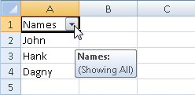
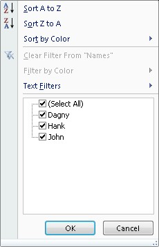

```c#
var wb = new XLWorkbook();
var ws = wb.Worksheets.Add("AutoFilter");
ws.Cell("A1").Value = "Names";
ws.Cell("A2").Value = "John";
ws.Cell("A3").Value = "Hank";
ws.Cell("A4").Value = "Dagny";

ws.RangeUsed().SetAutoFilter();

// Your can turn off the autofilter by:
// 1) worksheet.AutoFilter.Clear()
// 2) worksheet.SetAutoFilter(false)
// 3) Pick any range in the worksheet and call the above methods on the range

wb.SaveAs("AutoFilter.xlsx");
```
