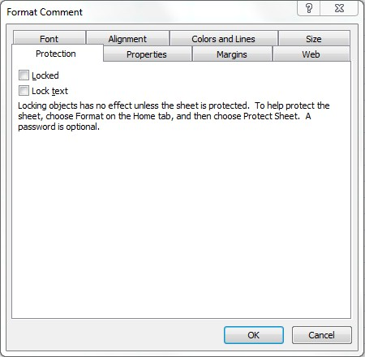

  

```c#
var wb = new XLWorkbook();
var ws = wb.Worksheets.Add("Protection");

ws.Cell("A1").Comment.Style
  .Protection.SetLocked(false)
  .Protection.SetLockText(false);

wb.SaveAs("CommentsProtection.xlsx");
```
