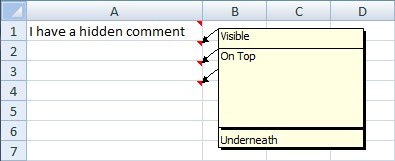

  

```c#
var wb = new XLWorkbook();
var ws = wb.Worksheets.Add("Visibility");

// By default comments are hidden
ws.Cell("A1").SetValue("I have a hidden comment").Comment.AddText("Hidden");

// Set the comment as visible
ws.Cell("A2").Comment.SetVisible().AddText("Visible");

// The ZOrder on previous comments were 1 and 2 respectively
// here we're explicit about the ZOrder
ws.Cell("A3").Comment.SetZOrder(5).SetVisible().AddText("On Top");

// We want this comment to appear underneath the one for A3
// so we set the ZOrder to something lower
ws.Cell("A4").Comment.SetZOrder(4).SetVisible().AddText("Underneath");
ws.Cell("A4").Comment.Style.Alignment.SetVertical(XLDrawingVerticalAlignment.Bottom);

// Alternatively you could set all comments to visible with the following line:
// ws.CellsUsed(true, c => c.HasComment).ForEach(c => c.Comment.SetVisible());

ws.Columns().AdjustToContents();

wb.SaveAs("CommentsVisibility.xlsx");
```
