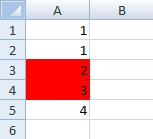
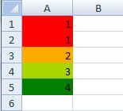
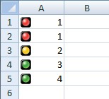
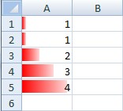

**Range of numbers**  

  
```c#
var workbook = new XLWorkbook();
var ws = workbook.AddWorksheet("Sheet1");

ws.FirstCell().SetValue(1)
  .CellBelow().SetValue(1)
  .CellBelow().SetValue(2)
  .CellBelow().SetValue(3)
  .CellBelow().SetValue(4);

ws.RangeUsed().AddConditionalFormat().WhenBetween(2, 3)
  .Fill.SetBackgroundColor(XLColor.Red);

```

**Color Scale**  

  
```
var workbook = new XLWorkbook();
var ws = workbook.AddWorksheet("Sheet1");

ws.FirstCell().SetValue(1)
  .CellBelow().SetValue(1)
  .CellBelow().SetValue(2)
  .CellBelow().SetValue(3)
  .CellBelow().SetValue(4);

ws.RangeUsed().AddConditionalFormat().ColorScale()
  .LowestValue(XLColor.Red)
  .Midpoint(XLCFContentType.Percent, 50, XLColor.Yellow)
  .HighestValue(XLColor.Green);
```

  
```
var workbook = new XLWorkbook();
var ws = workbook.AddWorksheet("Sheet1");

ws.FirstCell().SetValue(1)
  .CellBelow().SetValue(1)
  .CellBelow().SetValue(2)
  .CellBelow().SetValue(3)
  .CellBelow().SetValue(4);

ws.RangeUsed().AddConditionalFormat().IconSet(XLIconSetStyle.ThreeTrafficLights2)
  .AddValue(XLCFIconSetOperator.EqualOrGreaterThan, 0, XLCFContentType.Number)
  .AddValue(XLCFIconSetOperator.EqualOrGreaterThan, 2, XLCFContentType.Number)
  .AddValue(XLCFIconSetOperator.EqualOrGreaterThan, 3, XLCFContentType.Number);
```

  
```
var workbook = new XLWorkbook();
var ws = workbook.AddWorksheet("Sheet1");

ws.FirstCell().SetValue(1)
  .CellBelow().SetValue(1)
  .CellBelow().SetValue(2)
  .CellBelow().SetValue(3)
  .CellBelow().SetValue(4);

ws.RangeUsed().AddConditionalFormat().DataBar(XLColor.Red)
  .LowestValue()
  .HighestValue();
```

**Using Formulas**  
Just put your match with an = sign. e.g.  
```c#
.AddConditionalFormat().WhenEquals("=B1")
```

If you need to start the string with an equal sign then put the entire string between quotes (`"\"=Hello\""`)  
