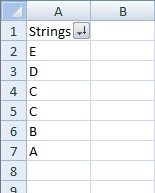
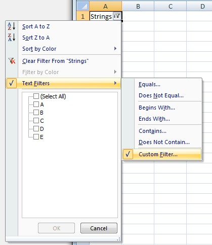
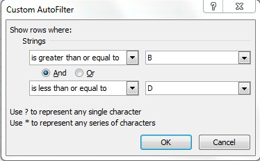
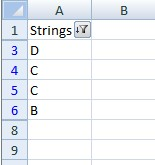

  

  

  

  

```c#
var wb = new XLWorkbook();
var ws = wb.Worksheets.Add("AutoFilter");

// Add a bunch of strings to filter
ws.Cell("A1").SetValue("Strings")
  .CellBelow().SetValue("B")
  .CellBelow().SetValue("C")
  .CellBelow().SetValue("C")
  .CellBelow().SetValue("E")
  .CellBelow().SetValue("A")
  .CellBelow().SetValue("D");

// Add filters
ws.RangeUsed().SetAutoFilter().Column(1).Between("B", "D");

// Sort the filtered list
ws.AutoFilter.Sort(1, XLSortOrder.Descending);

wb.SaveAs("AutoFilter.xlsx");
```
