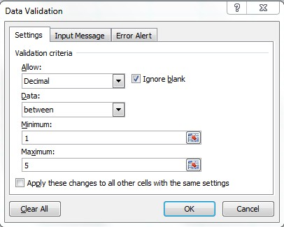
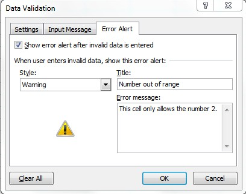
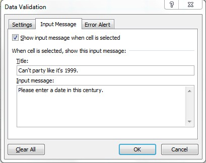
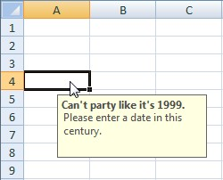
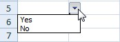

```c#
var wb = new XLWorkbook();
var ws = wb.Worksheets.Add("Data Validation");
```

**Decimal between 1 and 5**  



```c#
ws.Cell(1, 1).DataValidation.Decimal.Between(1, 5);
```

**Whole number equals 2, use an error message**  



```c#
var dv1 = ws.Range("A2:A3").DataValidation;
dv1.WholeNumber.EqualTo(2);

dv1.ErrorStyle = XLErrorStyle.Warning;
dv1.ErrorTitle = "Number out of range";
dv1.ErrorMessage = "This cell only allows the number 2.";
```

**Date after the millenium, use an input message**  




```c#
var dv2 = ws.Cell("A4").DataValidation;
dv2.Date.EqualOrGreaterThan(new DateTime(2000, 1, 1));

dv2.InputTitle = "Can't party like it's 1999.";
dv2.InputMessage = "Please enter a date in this century.";
```

**From a list**  



```c#
ws.Cell("C1").Value = "Yes";
ws.Cell("C2").Value = "No";
ws.Cell("A5").DataValidation.List(ws.Range("C1:C2"));
```

**From a List in code**
```c#
//Pass a string in this format: "Option1,Option2,Option3"
var options = new List<string>{"Option1","Option2","Option3"};
var validOptions = $"\"{String.Join(",", options)}\"";
ws.Cell(1,1).DataValidation.List(validOptions, true);
```