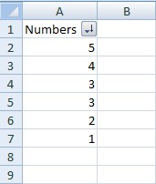
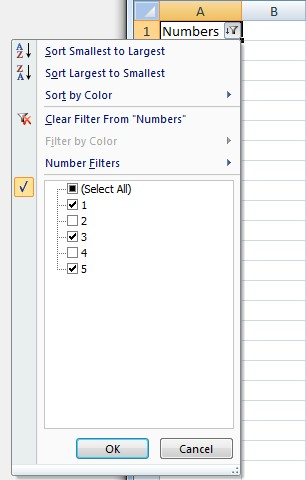
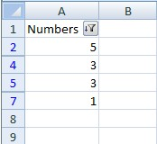

  

  

  

```c#
var wb = new XLWorkbook();
var ws = wb.Worksheets.Add("AutoFilter");

// Add a bunch of strings to filter
ws.Cell("A1").SetValue("Numbers")
  .CellBelow().SetValue(2)
  .CellBelow().SetValue(3)
  .CellBelow().SetValue(3)
  .CellBelow().SetValue(5)
  .CellBelow().SetValue(1)
  .CellBelow().SetValue(4);

// Add filters
ws.RangeUsed().SetAutoFilter().Column(1).AddFilter(3)
  .AddFilter(1)
  .AddFilter(5);

// Sort the filtered list
ws.AutoFilter.Sort(1);

wb.SaveAs("AutoFilter.xlsx");
```
