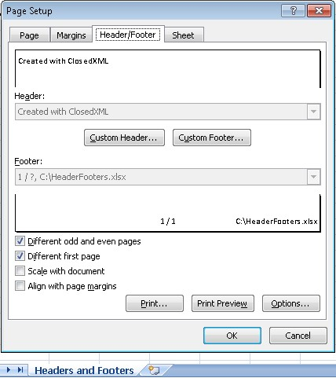
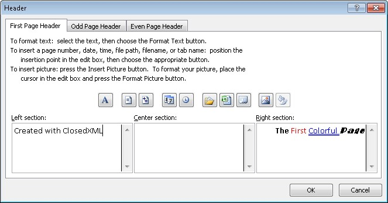
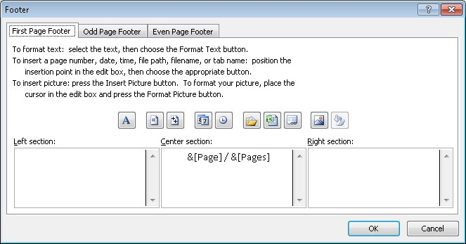
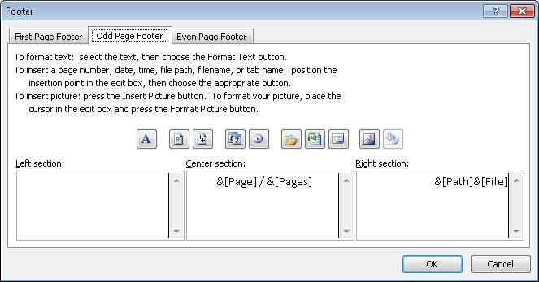

  

**Note 1**  
There is no option to turn on/off the "Different odd and even pages" or "Different first page". This is because ClosedXML always uses all headers even if it leaves them blank.  

**Adding custom text:**  

  

```c#
var workbook = new XLWorkbook();
var ws = workbook.Worksheets.Add("Headers and Footers");

// Simple left header to be placed on all pages
ws.PageSetup.Header.Left.AddText("Created with ClosedXML");

// Using various font decorations for the right header on the first page only
// Here we show different methods for setting font decorations.

// Set single font decorations immediately
ws.PageSetup.Header.Right.AddText("The ", XLHFOccurrence.FirstPage).SetBold();
ws.PageSetup.Header.Right.AddText("First ", XLHFOccurrence.FirstPage).SetFontColor(XLColor.Red);

// Use the IXLRichText returned by the AddText(...) method to later on modify the font
var richText = ws.PageSetup.Header.Right.AddText("Colorful ", XLHFOccurrence.FirstPage);
richText.FontColor = XLColor.Blue;
richText.Underline = XLFontUnderlineValues.Double;

// Set multiple font decorations chained
ws.PageSetup.Header.Right.AddText("Page", XLHFOccurrence.FirstPage)
  .SetBold()
  .SetItalic()
  .SetFontName("Broadway");
```

**Adding predefined header/footer text:**  

  

```c#
// Let's put the current page number and total pages on the center of every footer:
ws.PageSetup.Footer.Center.AddText(XLHFPredefinedText.PageNumber, XLHFOccurrence.AllPages);
ws.PageSetup.Footer.Center.AddText(" / ", XLHFOccurrence.AllPages);
ws.PageSetup.Footer.Center.AddText(XLHFPredefinedText.NumberOfPages, XLHFOccurrence.AllPages);
```

  

```c#
// Let's put the full path to the file on the right footer of every odd page:
ws.PageSetup.Footer.Right.AddText(XLHFPredefinedText.FullPath, XLHFOccurrence.OddPages);
```

**Note 2:**  
The default state is for the headers and footers to align with the margins and scale with the document.  
In this example we're just showing that you have the option to change it.  

```c#
// Don't align headers and footers with the margins
ws.PageSetup.AlignHFWithMargins = false;

// Don't scale headers and footers with the document
ws.PageSetup.ScaleHFWithDocument = false;

workbook.SaveAs("HeadersFooters.xlsx");
```
