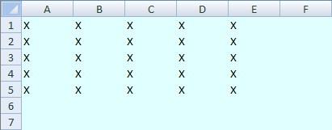
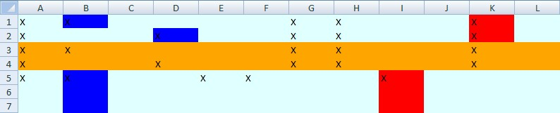

**Create a new worksheet and fill some cells**  
```c#
var workbook = new XLWorkbook();
var ws = workbook.Worksheets.Add("Inserting Columns");

// Color the entire spreadsheet using columns
ws.Columns().Style.Fill.BackgroundColor = XLColor.LightCyan;

// Put a value in a few cells
foreach (var r in Enumerable.Range(1, 5))
  foreach (var c in Enumerable.Range(1, 5))
    ws.Cell(r, c).Value = "X";
```

  

**Now let's play inserting rows to the worksheet and ranges**  
```c#
var blueColumn = ws.Column(2);
var redColumn = ws.Column(5);

blueColumn.Style.Fill.BackgroundColor = XLColor.Blue;
blueColumn.InsertColumnsAfter(2);

redColumn.Style.Fill.BackgroundColor = XLColor.Red;
redColumn.InsertColumnsBefore(2);

ws.Rows(3, 4).Style.Fill.BackgroundColor = XLColor.Orange;
ws.Range("B1:D1").InsertColumnsAfter(2);
ws.Range("B2:D2").InsertColumnsBefore(2);
ws.Range("B3:D3").InsertColumnsAfter(2);
ws.Range("B4:D4").InsertColumnsBefore(2);

workbook.SaveAs("InsertingColumns.xlsx");
```


