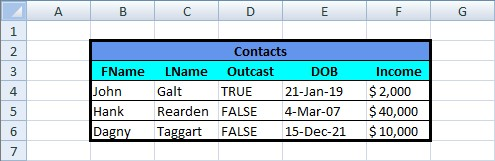
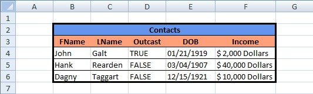

**Loading a workbook created with ClosedXML:**  
```c#
var workbook = new XLWorkbook("BasicTable.xlsx");
```

  

**Modifying the workbook:**  
```c#
var ws = workbook.Worksheet(1);

// Change the background color of the headers
var rngHeaders = ws.Range("B3:F3");
rngHeaders.Style.Fill.BackgroundColor = XLColor.LightSalmon;

// Change the date formats
var rngDates = ws.Range("E4:E6");
rngDates.Style.DateFormat.Format = "MM/dd/yyyy";

// Change the income values to text
var rngNumbers = ws.Range("F4:F6");
foreach (var cell in rngNumbers.Cells())
{
  cell.DataType = XLCellValues.Text;
  cell.Value += " Dollars";
}
```

  

**Saving the workbook:**  
```c#
workbook.SaveAs("BasicTable_Modified.xlsx");
```
