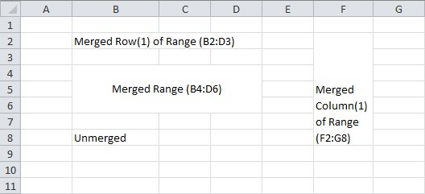

## Merging Cells

  

### Creating merged cells
```c#
var workbook = new XLWorkbook();
var ws = workbook.Worksheets.Add("Merge Cells");

// Merge a row
ws.Cell("B2").Value = "Merged Row(1) of Range (B2:D3)";
ws.Range("B2:D3").Row(1).Merge();

// Merge a column
ws.Cell("F2").Value = "Merged Column(1) of Range (F2:G8)";
ws.Cell("F2").Style.Alignment.WrapText = true;
ws.Range("F2:G8").Column(1).Merge();

// Merge a range
ws.Cell("B4").Value = "Merged Range (B4:D6)";
ws.Cell("B4").Style.Alignment.Horizontal = XLAlignmentHorizontalValues.Center;
ws.Cell("B4").Style.Alignment.Vertical = XLAlignmentVerticalValues.Center;
ws.Range("B4:D6").Merge();

// Unmerging a range...
ws.Cell("B8").Value = "Unmerged";
ws.Range("B8:D8").Merge();
ws.Range("B8:D8").Unmerge();

workbook.SaveAs("MergeCells.xlsx");
```

### Finding the range of merged cells
```c#
var mergedRange = ws.MergedRanges.First(r => r.Contains("B4"));
mergedRange.Style.Fill.BackgroundColor = XLColor.Red;
```
