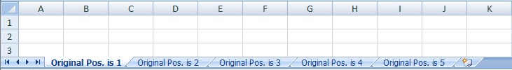
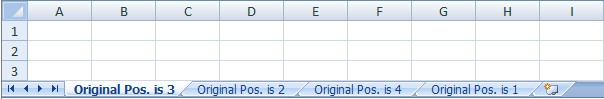

First let's create 5 sheets:  
```c#
var wb = new XLWorkbook();
foreach (var wsNum in Enumerable.Range(1, 5))
{
  wb.Worksheets.Add("Original Pos. is " + wsNum.ToString());
}

```

  

And now let's play with their order:  

```c#
// Move first worksheet to the last position
wb.Worksheet(1).Position = wb.Worksheets.Count() + 1;

// Delete worksheet on position 4 (in this case it's where original position = 5)
wb.Worksheet(4).Delete();

// Swap sheets in positions 1 and 2
wb.Worksheet(2).Position = 1;

wb.SaveAs("OrganizingSheets.xlsx");
```


