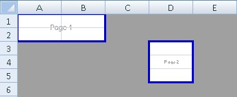
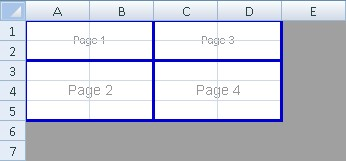

**Separate Print Areas**  

  

```c#
var workbook = new XLWorkbook();
var ws1 = workbook.Worksheets.Add("Separate PrintAreas");
ws1.PageSetup.PrintAreas.Add("A1:B2");
ws1.PageSetup.PrintAreas.Add("D3:D5");
```

**Page Breaks**  

  

```c#
var ws2 = workbook.Worksheets.Add("Page Breaks");
ws2.PageSetup.PrintAreas.Add("A1:D5");
ws2.PageSetup.AddHorizontalPageBreak(2);
ws2.PageSetup.AddVerticalPageBreak(2);

workbook.SaveAs("PrintAreas.xlsx");
```
