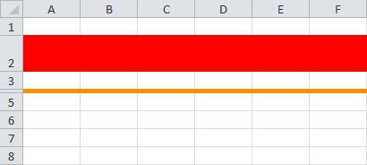

  

```c#
var workbook = new XLWorkbook();
var ws = workbook.Worksheets.Add("Row Settings");

var row1 = ws.Row(2);
row1.Style.Fill.BackgroundColor = XLColor.Red;
row1.Height = 30;

var row2 = ws.Row(4);
row2.Style.Fill.BackgroundColor = XLColor.DarkOrange;
row2.Height = 3;

workbook.SaveAs("RowSettings.xlsx");
```
