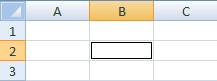
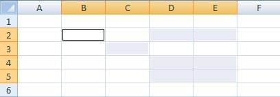

## Set the active cell

```c#
var wb = new XLWorkbook();
var wsActiveCell = wb.AddWorksheet("Set Active Cell");
wsActiveCell.Cell("B2").SetActive();
```

  

## Select cells and ranges

```c#
var wsSelectMisc = wb.AddWorksheet("Select Misc");
wsSelectMisc.Cell("B2").Select();
wsSelectMisc.Range("D2:E2").Select();
wsSelectMisc.Ranges("C3, D4:E5").Select();
```

  
