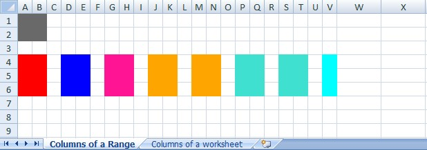
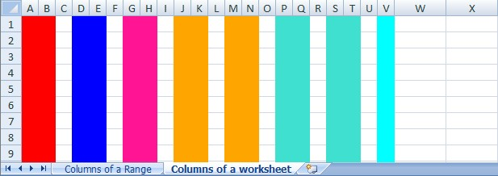

## Selecting Columns of a Range

  

```c#
var workbook = new XLWorkbook();
var ws = workbook.Worksheets.Add("Columns of a Range");

// All columns in a range
ws.Range("A1:B2").Columns().Style.Fill.BackgroundColor = XLColor.DimGray;

var bigRange = ws.Range("A4:V6");

// Contiguous columns by number
bigRange.Columns(1, 2).Style.Fill.BackgroundColor = XLColor.Red;

// Contiguous columns by letter
bigRange.Columns("D", "E").Style.Fill.BackgroundColor = XLColor.Blue;

// Contiguous columns by letter
bigRange.Columns("G:H").Style.Fill.BackgroundColor = XLColor.DeepPink;

// Spread columns by number
bigRange.Columns("10:11,13:14").Style.Fill.BackgroundColor = XLColor.Orange;

// Spread columns by letter
bigRange.Columns("P:Q,S:T").Style.Fill.BackgroundColor = XLColor.Turquoise;

// Use a single number/letter
bigRange.Columns("V").Style.Fill.BackgroundColor = XLColor.Cyan;

// Only the used columns in a worksheet
ws.Columns("A:V").Width = 3; 
```

## Selecting Columns of a Worksheet

  

```c#
var ws2 = workbook.Worksheets.Add("Columns of a worksheet");

// Contiguous columns by number
ws2.Columns(1, 2).Style.Fill.BackgroundColor = XLColor.Red;

// Contiguous columns by letter
ws2.Columns("D", "E").Style.Fill.BackgroundColor = XLColor.Blue;

// Contiguous columns by letter
ws2.Columns("G:H").Style.Fill.BackgroundColor = XLColor.DeepPink;

// Spread columns by number
ws2.Columns("10:11,13:14").Style.Fill.BackgroundColor = XLColor.Orange;

// Spread columns by letter
ws2.Columns("P:Q,S:T").Style.Fill.BackgroundColor = XLColor.Turquoise;

// Use a single number/letter
ws2.Columns("V").Style.Fill.BackgroundColor = XLColor.Cyan;

ws2.Columns("A:V").Width = 3;

workbook.SaveAs("SelectingColumns.xlsx");
```
