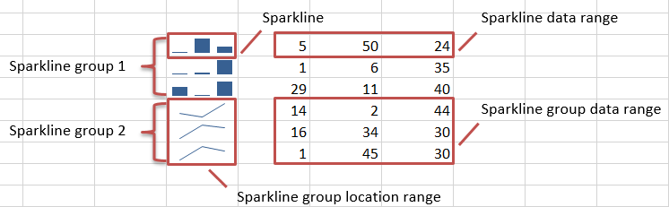
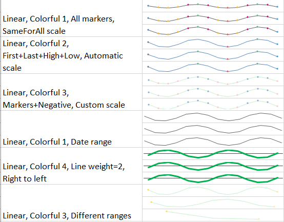
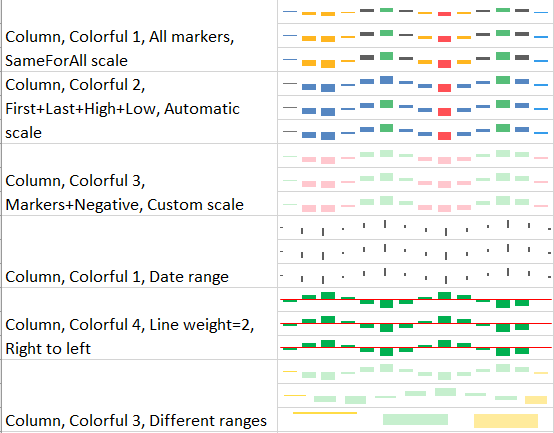
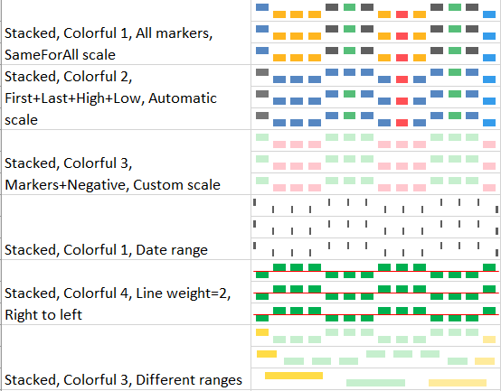

# Spaklines
Starting from version 0.95, ClosedXML provides basic support for sparklines manipulation.

## Definitions

A _sparkline_ is a small chart in a worksheet cell that provides a visual representation of data.

_Sparklines_ are combined in _sparkline groups_. A _sparkline group_ establishes formatting rules that apply to all _sparklines_ in this group, while each _sparkline_ specifies a cell it belongs to and the range it gets the data from.



Essentially, each worksheet contains a collection of _sparkline groups_, each _sparkline group_ contains a collection of _sparklines_.

## Creating sparklines

Probably the most natural way to create sparklines is to specify where to put them, where they have to get the data from, and how do they look like. Given a worksheet `ws` (of type `IXLWorksheet`) to create a new sparkline group do this:

```
var spGroup = ws.SparklineGroups.Add(ws.Range("A1:A3"), ws.Range("B1:E3"));
```

This will replace the contents of cells `A1:A3` with the sparklines belonging to a newly created group `spGroup`. Each sparkline in the group will refer to a corresponding data range: a sparkline in the cell `A1` refers to the range `B1:E1`, cell `A2` - to the range `B2:E2`, and so on. This dictates certain limitations to the input data: 
* the first argument, `locationRange`, can be either one-column-wide, or one-row-high,
* the second argument, `sourceDataRange`, must have the same height, or the same width as the `locationRange`.

Otherwise, ClosedXML will not be able to determine which ranges each sparkline must refer to and will throw an exception.

If you want to create more comprehensive sparkline groups, for example, if each cell should reflect data from different, not connected ranges, then you can add sparklines manually, one after another.

```
var spGroup = ws.SparklineGroups.Add("A2", "B2:E2"); // Create a group with a single sparkline
spGroup.Add(ws.Cell("A3"), ws.Range("X18:X42"));
spGroup.Add(ws.Cell("A5"), ws.Range("Y4:Z4"));
```

Note that each particular data range must also be either one-row-high or one-column-wide, but ranges for different sparklines in a group may have different directions and sizes.

## Styling sparklines

ClosedXML bring the ability to finely tune the appearance of sparklines. There are three different types of sparklines:
* Linear,
* Column
* Stacked

Here are a few examples of each type of sparklines:

  

And here is the sample code for generating one of those sparklines:

```
ws1.SparklineGroups.Add("B14:B16", "C14:P16")
                .SetStyle(XLSparklineTheme.Colorful4)
                .SetLineWeight(2)
                .HorizontalAxis
                .SetVisible(true)
                .SetColor(XLColor.Red)
                .SetRightToLeft(true);
```

More samples can be found in [Examples project](https://github.com/ClosedXML/ClosedXML/blob/develop/ClosedXML_Examples/Sparklines/SampleSparklines.cs).

## Reading sparklines

Once sparklines are created they can be accessed from code.

To enumerate all sparkline groups existing on a worksheet use `ws.SparklineGroups`.

To get the information if the particular cell contains sparklines you can either check `cell.HasSparkline` or `cell.Sparkline != null` which is essentially the same.

To enumerate sparklines for cells in the specified range you dont have to check every cell in that range - that would be least efficient. Much more efficient is to call a dedicated method of `IXLSparklineGroups`:

```
var range =  ws.Range("C15:E40");

// !!!DO NOT DO THIS!!!
foreach (var xlCell in r.Cells())
    if (xlCell.HasSparkline) { ... }

// RATHER DO THIS:
var sparklinesInRange = ws.SparklineGroups.GetSparklines(r);
```

For large ranges the difference will be drastic.

Having an instance of `IXLSparkline` you have the access to its group via `sparkline.SparklineGroup` property, as well as to `Location` cell and `SourceData` range. The `IsValid` property checks that both `Location` and `SourceData` have valid addresses (meaning, they not refer to something like `#REF!`).

An `IXLSparklineGroup` instance provides you an access to all styling properties, and, since it implements `IEnumerable<IXLSparkline>` - to all belonging sparklines. It does not store `locationRange` and `dataSourceRange` used for its creation because after the editing the sparkline group may not refer to any rectangular ranges.

## Editing sparklines

You can edit most of the aspected of sparklines in the most natural way - by changing the properties having setters, or using fluent methods:

```
sparkline
    .SetLocation(ws.Cell("D5"))
    .SetSourceData(ws.Range("E1:E5"));
// Equivalent to
sparkline.Location = ws.Cell("D5");
sparkline.SourceData = ws.Range("E1:E5");
```

Which way to use is just a matter of personal preferences.

You can find fairly detailed samples of how to deal with sparklines in the [ClosedXML_Tests project](https://github.com/ClosedXML/ClosedXML/blob/develop/ClosedXML_Tests/Excel/Sparklines/SparklinesTests.cs).

## Removing sparklines

ClosedXML provides the ability to delete certain sparklines ar entire sparkline groups. Note that deleting all sparklines in a group does not delete the group itself but such empty groups will be skipped during saving so reopening the workbook will purge them.

To remove all sparkline groups on a worksheet:
```
ws.SparklineGroups.RemoveAll();
```

To remove a single sparkline group:
```
ws.SparklineGroups.Remove(sparklineGroup);
```

To remove all sparklines in range:
```
ws.SparklineGroups.Remove(range);
// OR
range.Clear(XLClearOptions.Sparklines);
```

To remove a sparkline for a cell:
```
ws.SparklineGroups.Remove(cell);
//OR
cell.Clear(XLClearOptions.Sparklines);
```

Note that `XLClearOptions.All` includes `XLClearOptions.Sparkline` too.

## Credits

Thanks to @ghronkrepps for the initial sparklines implementation, to @igitur for many patient code reviews, and to @pankraty for dirty work of refactoring and leading this feature to release (unfortunate git squash drained out his name from the change log but he does not complain :D).