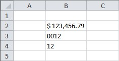

  

```c#
var workbook = new XLWorkbook();
var ws = workbook.Worksheets.Add("Style NumberFormat");

var co = 2;
var ro = 1;

// Using a custom format
ws.Cell(++ro, co).Value = "123456.789";
ws.Cell(ro, co).Style.NumberFormat.Format = "$ #,##0.00";

ws.Cell(++ro, co).Value = "12.345";
ws.Cell(ro, co).Style.NumberFormat.Format = "0000";

// Using a OpenXML's predefined formats
ws.Cell(++ro, co).Value = "12.345";
ws.Cell(ro, co).Style.NumberFormat.NumberFormatId = 3;

ws.Column(co).AdjustToContents();

workbook.SaveAs("StylesNumberFormat.xlsx");
```

For more information on NumberFormatId please see [NumberFormatId Lookup Table](NumberFormatId Lookup Table).
