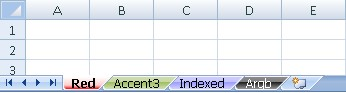

  

```c#
var wb = new XLWorkbook();

var wsRed = wb.Worksheets.Add("Red").SetTabColor(XLColor.Red);

var wsAccent3 = wb.Worksheets.Add("Accent3").SetTabColor(XLColor.FromTheme(XLThemeColor.Accent3));

var wsIndexed = wb.Worksheets.Add("Indexed");
wsIndexed.TabColor = XLColor.FromIndex(24);

var wsArgb = wb.Worksheets.Add("Argb");
wsArgb.TabColor = XLColor.FromArgb(23, 23, 23);

wb.SaveAs("TabColors.xlsx");
```
