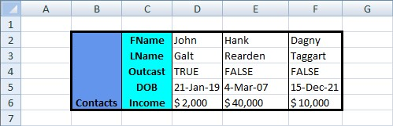

## Transpose Ranges

We start with the basic table:  

  

```c#
var workbook = new XLWorkbook("BasicTable.xlsx");
var ws = workbook.Worksheet(1);

var rngTable = ws.Range("B2:F6");

rngTable.Transpose(XLTransposeOptions.MoveCells);

ws.Columns().AdjustToContents();

workbook.SaveAs("TransposeRanges.xlsx");
```

And we end up with the following table:  
**Note:** Notice how the Transpose function correctly preserves the formats.  


