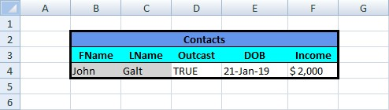

We start with the basic table:  

  

```c#
var workbook = new XLWorkbook("BasicTable.xlsx");
var ws = workbook.Worksheet(1);

// Define a range with the data
var firstDataCell = ws.Cell("B4");
var lastDataCell = ws.LastCellUsed();
var rngData = ws.Range(firstDataCell.Address, lastDataCell.Address);

// Delete all rows where Outcast = false (the 3rd column)
rngData.Rows(r => !r.Cell(3).GetBoolean()) // where the 3rd cell of each row is false
  .ForEach(r => r.Delete()); // delete the row and shift the cells up (the default for rows in a range)

// Put a light gray background to all text cells
rngData.Cells(c => c.DataType == XLCellValues.Text) // where the data type is Text
  .ForEach(c => c.Style.Fill.BackgroundColor = XLColor.LightGray); // Fill with a light gray

// Put a thick border to the bottom of the table (we may have deleted the bottom cells with the border)
rngData.LastRow().Style.Border.BottomBorder = XLBorderStyleValues.Thick;

workbook.SaveAs("LambdaExpressions.xlsx");
```

And we end up with the following table:  


